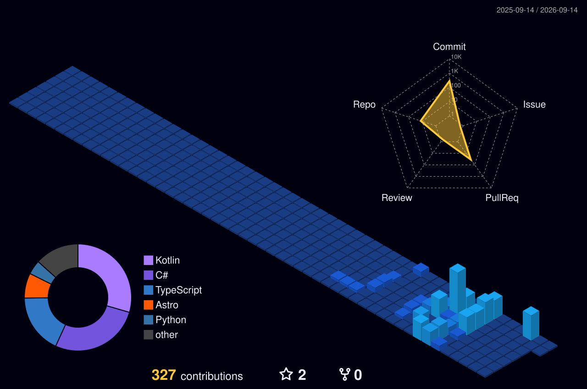

  

  

  <table border="1" bordercolor="#30363d" bgcolor="#161b22">
    <tr>
      <td align="center" width="550" height="135">
        
      </td>
    </tr>
  </table>

---

  

  

    

  

   

  

    

---

  

  

---

  

  

---

  

  <picture>
    <source media="(prefers-color-scheme: dark)" srcset="https://raw.githubusercontent.com/CZalbert67/CZalbert67/output/bomberman-contribution-graph-dark.svg">
    <source media="(prefers-color-scheme: light)" srcset="https://raw.githubusercontent.com/CZalbert67/CZalbert67/output/bomberman-contribution-graph.svg">
    
  </picture>

